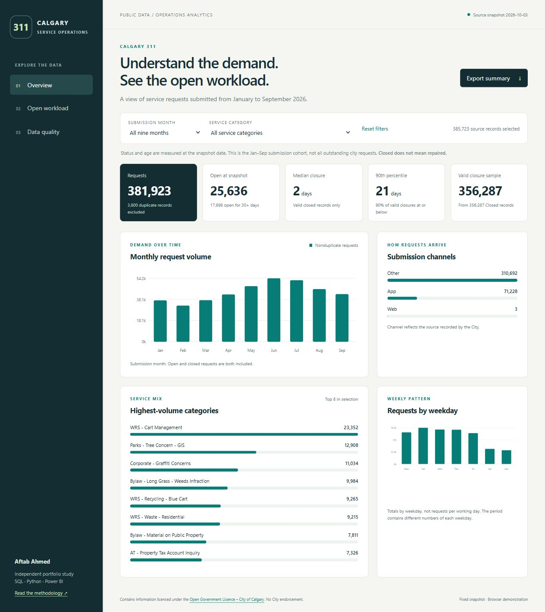

# Calgary 311 Service Operations Analytics

An independent portfolio project by **Aftab Ahmed** that examines service demand, administrative closure times and open request age using City of Calgary public data.

**381,923 nonduplicate requests · SQL and Python reconciliation · Three dashboard pages · Power BI project source**

[](https://github.com/Aftab-777/calgary-311-service-operations/actions/workflows/validate.yml)



## Explore

- [Explore the live dashboard](https://aftab-777.github.io/calgary-311-service-operations/dashboard/) — no login or subscription required.
- [Read the project and interview guide](https://aftab-777.github.io/calgary-311-service-operations/docs/GUIDE.html)
- For offline use, download this repository and open `dashboard/index.html`.
- [Methodology](docs/METHODOLOGY.md) · [Data dictionary](docs/DATA_DICTIONARY.md) · [Validation status](docs/VALIDATION.md)
- [Power BI opening instructions](powerbi/README.md)

The browser dashboard is functional and tested. The generated Power BI source passes JSON schema and embedded-data checks, but has **not been opened or refreshed in Power BI Desktop**. The screenshots show the browser dashboard, not Power BI.

## Questions answered

1. Which submission months and service categories account for the most requests?
2. Which categories have the largest open workload within this submission cohort?
3. How do median closure duration and its 90th percentile differ?
4. Which data-quality and interpretation issues affect those conclusions?

## Snapshot findings

Requests were submitted from **January 1 through September 30, 2026**. Status and age use the source snapshot dated **October 3, 2026**. This is a bounded submission cohort, not all outstanding requests in Calgary.

| Measure | Result |
|---|---:|
| Source records | 385,723 |
| Explicit duplicate records excluded | 3,800 |
| Nonduplicate requests | 381,923 |
| Closed records with valid duration | 356,287 |
| Open requests | 25,636 |
| Open for at least 30 calendar days | 17,898 |
| Median administrative closure duration | 2 days |
| 90th percentile closure duration | 21 days |
| Median age of open requests | 67 days |

June had the highest volume in this nine-month cohort, at **54,163** nonduplicate requests. WRS Cart Management was the largest service category, with **23,352** requests. Roads Signs Missing Damaged had the largest open count, at **2,746**, including **2,502** aged at least 30 days.

These findings identify topics for investigation. They do not establish SLA breaches, repair completion, staffing requirements, customer satisfaction or measured cost savings. Recent submission cohorts have had less time to close.

## Engineering and analytical choices

- Bounded, paginated public API extraction with a source-update stability check, unique IDs, row counts and a SHA-256 manifest.
- A request-level fact table, four related dimensions and one disconnected snapshot table.
- Python standard-library transformations and independent SQLite queries using joins and window functions.
- Explicit duplicate handling, date validation and separation of open age from closed duration.
- Exact histogram-based browser percentiles recomputed under filters; no averaging of category medians.
- Portable embedded CSV snapshots in a generated PBIP/PBIR/TMDL model with 14 DAX measures.
- Automated regression checks and a GitHub Actions workflow that publishes the live demonstration only after validation passes. The badge above links to the latest run.

## Run locally

For the quickest view, open `dashboard/index.html` in a modern browser. Alternatively, from the repository root:

```sh
python -m http.server 8000
```

Then open `http://localhost:8000/dashboard/`.

Rebuild with Python 3.10 or later and Node.js 18 or later. The main pipeline has no third-party package dependencies:

```sh
python -m unittest discover -s tests -v
python scripts/build.py
python scripts/build_powerbi.py
python scripts/check_model.py
node tests/test_dashboard.cjs
```

`data/requests.csv` is the preserved input. Do not download again to reproduce this snapshot. An optional network refresh uses `node scripts/download_data.mjs`, followed by the build commands; it replaces the input and manifest. Because the live source changes, a new download can produce different historical statuses and counts. Narrative findings and screenshots must then be reviewed and updated manually.

Optional Microsoft JSON schema validation requires `npm install` for the two development dependencies, then `npm run validate:schema`. This check fetches the official schemas and needs network access; it is separate from the dependency-free main pipeline.

## Repository map

| Folder | Purpose |
|---|---|
| `data/` | Selected source fields, checksum manifest, schema and model tables |
| `scripts/` | Download, transform, generate and validate |
| `sql/` | Independent summary, dimension and percentile queries |
| `analysis/` | Machine-readable findings and validation evidence |
| `dashboard/` | Offline browser demonstration with month and service filters |
| `powerbi/` | DAX, opening instructions and portable project source |
| `tests/` | Edge-case fixtures and browser metric reconciliation |
| `docs/` | Methodology, dictionary, guide and actual browser screenshots |

## Data attribution and licensing

Contains information licensed under the [Open Government Licence – City of Calgary](https://data.calgary.ca/stories/s/u45n-7awa/). Source: [City of Calgary 311 Service Requests](https://data.calgary.ca/Services-and-Amenities/311-Service-Requests/iahh-g8bj), dataset `iahh-g8bj`. Retrieved October 4, 2026 UTC, which was October 3 in Calgary.

No City affiliation or endorsement is implied. Street addresses and precise coordinates are not included. Original project code is licensed under [MIT](LICENSE); City data retains its separate source licence.
